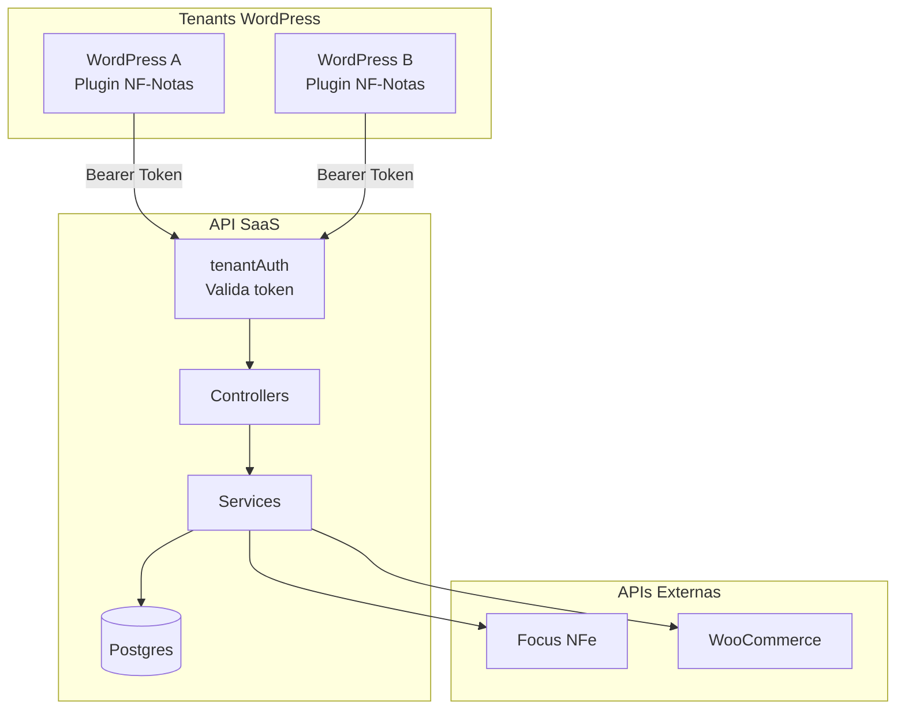
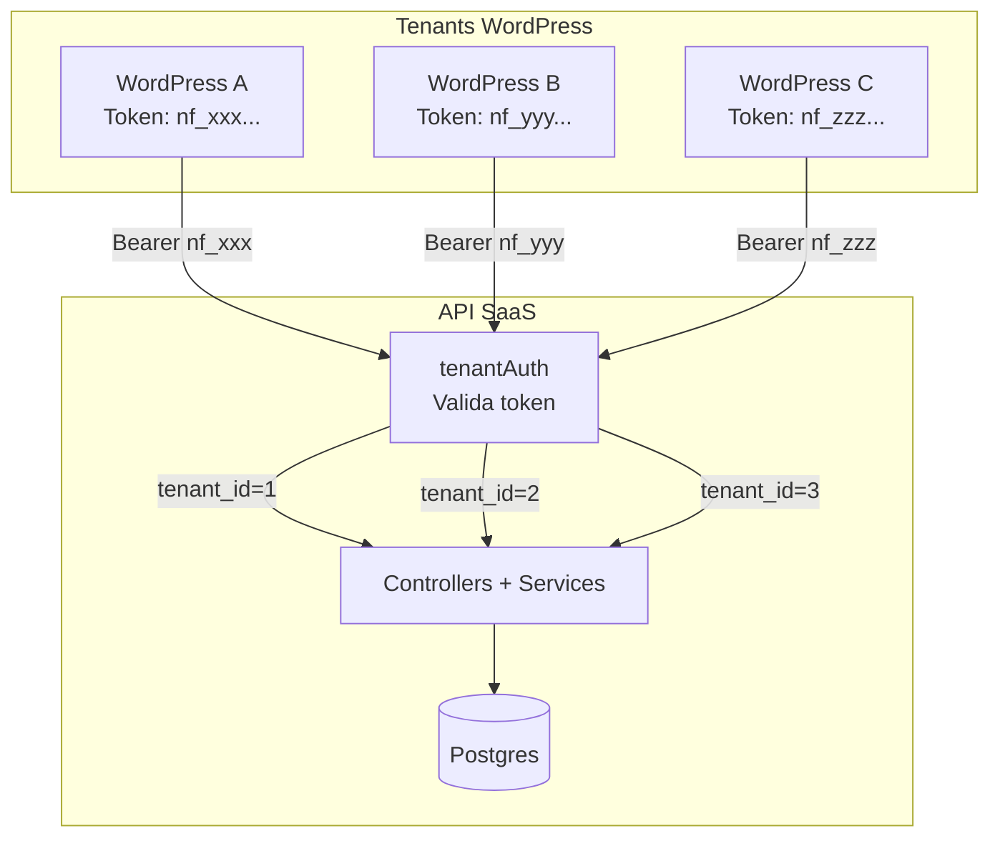
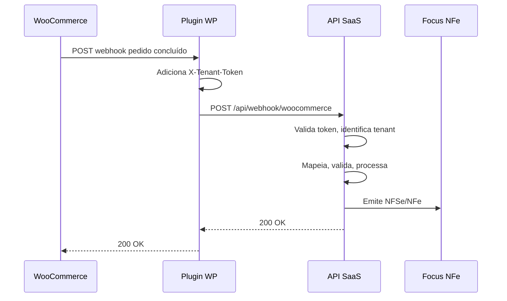
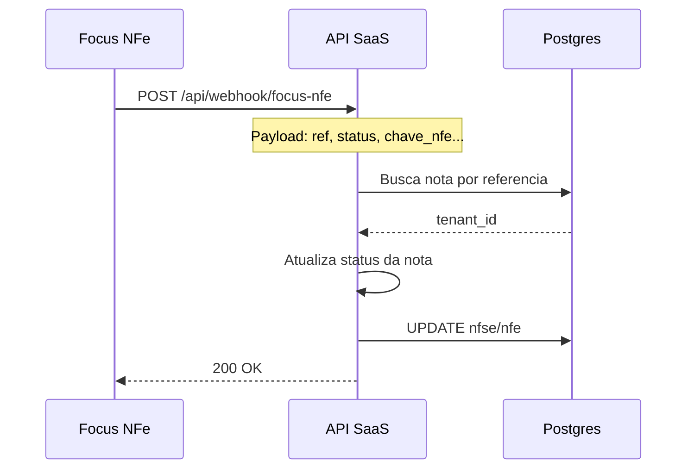
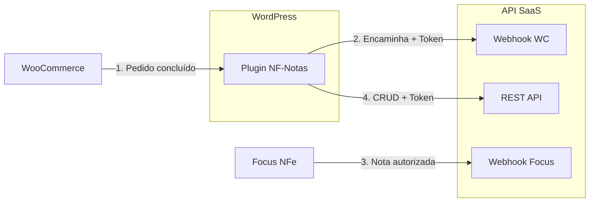

# Arquitetura: Plugin WordPress + API SaaS

> **Opção 2**: Plugin (frontend) + API SaaS (seu servidor)  
> Documento de planejamento baseado no projeto WP-Notas existente.

---

## 1. Diagrama de Arquitetura

### 1.1 Visão geral multi-tenant



O WooCommerce envia webhooks para o Plugin (não direto para a API). O Plugin encaminha com token. A Focus NFe envia webhooks direto para a API.

### 1.2 Fluxo multi-tenant

Múltiplos sites WordPress, cada um com token único, consumindo a mesma API. Isolamento por `tenant_id` no banco.



### 1.3 Fluxo webhook WooCommerce (Plugin como proxy)

WooCommerce envia para o WordPress. O plugin recebe e encaminha para a API com o token do tenant.



### 1.4 Fluxo webhook Focus NFe (direto para API)

A Focus NFe envia notificações diretamente para a URL pública da API. O tenant é identificado pela referência da nota no banco.



### 1.5 Visão consolidada



---

## 2. Divisão de Responsabilidades

### O que vai no **Plugin WordPress**

| Função | Por quê | Implementação |
|--------|---------|---------------|
| Dashboard de notas fiscais | Interface nativa WP, UX familiar | Reutilizar layout CSS/JS do projeto atual |
| Listar notas (NFSe/NFe) | WP_List_Table nativo | Chamar API com token |
| Configurações (Focus, emitente, WooCommerce) | WP Options API, segurança WP | Salvar em `options`, enviar para API |
| Logs de operações | CPT ou tabela própria | API retorna logs; plugin exibe |
| Geração de token de API | Segurança WP, nonce | `wp_generate_password(64)` + salvar hash |
| Botão "Emitir NFSe" | Ações manuais no admin | AJAX → API |
| Webhook receiver (WooCommerce) | Eventos WP, REST API | Recebe webhook, encaminha para API com token |
| Relatórios/gráficos | WP Admin, Charts.js | Dados da API |

### O que vai no **Servidor (API SaaS)**

| Função | Por quê | Implementação |
|--------|---------|---------------|
| Processamento de notas (mapeamento, validação) | Lógica complexa, reutilizar mapeador | Manter `mapeador.js`, `validator.js` |
| Envio para Focus NFe | Timeout alto, retry | Manter `focusNFSe.js`, `focusNFe.js` |
| Geração/download XML/PDF | Processamento pesado | Manter lógica de backups |
| Webhooks da Focus NFe | Recebe notificações direto | Endpoint público, identifica tenant |
| Rate limiting | Proteção por tenant | `express-rate-limit` por token |
| Retry automático | Resiliência | Axios interceptors, queue |
| Multi-tenancy | Isolamento de dados | `tenant_id` em todas as queries |

---

## 3. Modelo de Dados Multi-Tenant

### Nova tabela: `tenants`

```sql
CREATE TABLE tenants (
  id SERIAL PRIMARY KEY,
  token_hash TEXT UNIQUE NOT NULL,        -- hash do token (nunca salvar token em claro)
  nome TEXT,                             -- nome do cliente/site
  site_url TEXT,                         -- URL do WordPress
  created_at TIMESTAMPTZ DEFAULT NOW(),
  updated_at TIMESTAMPTZ DEFAULT NOW(),
  ativo BOOLEAN DEFAULT true
);
```

### Tabelas existentes: adicionar `tenant_id`

```sql
-- Todas as tabelas recebem tenant_id
ALTER TABLE pedidos ADD COLUMN tenant_id INTEGER REFERENCES tenants(id);
ALTER TABLE nfse ADD COLUMN tenant_id INTEGER REFERENCES tenants(id);
ALTER TABLE nfe ADD COLUMN tenant_id INTEGER REFERENCES tenants(id);
ALTER TABLE logs ADD COLUMN tenant_id INTEGER REFERENCES tenants(id);
-- configuracao: já tem chave/valor, adicionar tenant_id
```

### Configurações por tenant

Cada tenant tem suas credenciais no banco:

- `FOCUS_NFE_TOKEN_HOMOLOGACAO` (por tenant)
- `FOCUS_NFE_TOKEN_PRODUCAO` (por tenant)
- `FOCUS_NFE_AMBIENTE` (por tenant)
- `PRESTADOR_*` (emitente, por tenant)
- `WOOCOMMERCE_*` (por tenant)

---

## 4. Estrutura de Pastas

### 4.1 Plugin WordPress (`wp-nf-notas-plugin/`)

```
wp-nf-notas-plugin/
├── wp-nf-notas.php                 # Arquivo principal do plugin
├── readme.txt
├── uninstall.php
│
├── includes/
│   ├── class-nf-notas-admin.php    # Menu admin, páginas
│   ├── class-nf-notas-api-client.php # Cliente HTTP para API SaaS
│   ├── class-nf-notas-webhook.php  # Receiver webhook WooCommerce
│   ├── class-nf-notas-token.php    # Geração/validação token
│   └── class-nf-notas-settings.php # Configurações (WP Options)
│
├── admin/
│   ├── css/
│   │   └── admin.css               # Reutilizar style.css do projeto
│   ├── js/
│   │   ├── app.js                  # Adaptar do public/js/app.js
│   │   ├── api.js                  # Adaptar: base_url = API_SAAS
│   │   └── components.js            # Adaptar do public/js/components.js
│   └── views/
│       ├── dashboard.php           # Dashboard principal
│       ├── notas-list.php          # Lista de notas (WP_List_Table)
│       ├── pedidos-list.php        # Lista de pedidos
│       ├── config-focus.php         # Config Focus NFe
│       ├── config-emitente.php      # Config emitente
│       ├── config-woocommerce.php   # Config WooCommerce
│       ├── config-token.php        # Gerar/ver token API
│       └── logs.php                # Logs
│
└── assets/
    └── (ícones, imagens)
```

### 4.2 API SaaS (`api-saas/` ou evoluir `WP-Notas/`)

```
api-saas/                          # Ou: WP-Notas/ (projeto atual)
├── server.js
├── config.js
├── package.json
├── vercel.json
│
├── src/
│   ├── config/
│   │   └── database.js             # + migrations tenant
│   │
│   ├── middleware/
│   │   ├── auth.js                 # requireAuth (existente)
│   │   └── tenantAuth.js           # NOVO: validar token, injetar tenant_id
│   │
│   ├── routes/
│   │   ├── webhook.js              # + header X-Tenant-Token no /woocommerce
│   │   ├── nfse.js                 # + tenantAuth
│   │   ├── pedidos.js              # + tenantAuth
│   │   ├── config.js               # + tenantAuth, config por tenant
│   │   ├── backups.js              # + tenantAuth
│   │   ├── excel.js                # + tenantAuth
│   │   ├── woocommerce.js          # + tenantAuth
│   │   └── tenants.js              # NOVO: registro de tenants (admin interno)
│   │
│   ├── controllers/
│   │   └── (existentes, passar tenant_id)
│   │
│   ├── services/
│   │   ├── focusNFSe.js            # REUTILIZAR (recebe config por parâmetro)
│   │   ├── focusNFe.js             # REUTILIZAR
│   │   ├── woocommerce.js          # REUTILIZAR (credenciais por tenant)
│   │   ├── mapeador.js             # REUTILIZAR
│   │   ├── validator.js            # REUTILIZAR
│   │   ├── cepService.js           # REUTILIZAR
│   │   └── tenantService.js        # NOVO: buscar config por tenant
│   │
│   └── utils/
│       ├── mapeador.js             # REUTILIZAR
│       └── parseEndereco.js        # REUTILIZAR
│
├── migrations/
│   ├── 001_create_pedidos.sql
│   ├── 002_add_ambiente_nfse.sql
│   ├── 003_create_nfe.sql
│   └── 004_add_tenant_support.sql  # NOVO
│
└── public/                         # OPCIONAL: manter para admin interno
    └── (ou remover se tudo for no plugin)
```

---

## 5. Chaves e Configuração

### 5.1 Plugin (WP Options)

| Option Key | Descrição | Exemplo |
|------------|-----------|---------|
| `nf_notas_api_url` | URL base da API SaaS | `https://api.seudominio.com` |
| `nf_notas_api_token` | Token de autenticação (criptografado) | `nf_xxxxxxxx...` |
| `nf_notas_focus_*` | Cache local (opcional) | - |
| `nf_notas_emitente_*` | Cache local (opcional) | - |
| `nf_notas_woocommerce_*` | Cache local (opcional) | - |

O plugin **não** armazena tokens Focus nem credenciais WooCommerce em produção — envia para a API que persiste por tenant.

### 5.2 API SaaS (Variáveis de Ambiente)

| Variável | Descrição | Multi-tenant? |
|----------|-----------|--------------|
| `POSTGRES_URL` | Conexão banco | Não |
| `BASE_URL` | URL pública da API | Não |
| `RATE_LIMIT_PER_MINUTE` | Limite por token | Não |
| `ADMIN_SECRET` | Para registro de tenants | Não |

Configurações por tenant ficam no banco (`configuracao` com `tenant_id`).

### 5.3 Fluxo de Token

1. **Plugin**: Admin acessa "Configurações > Token API"
2. **Plugin**: Clica "Gerar novo token"
3. **Plugin**: Chama `POST /api/tenants/registrar` (primeira vez) ou `POST /api/tenants/renovar-token`
   - Body: `{ site_url, nome, token_atual? }`
   - Header: `Authorization: Bearer ADMIN_SECRET` (para registro inicial)
4. **API**: Cria/atualiza tenant, gera token, retorna token em claro **uma vez**
5. **Plugin**: Salva token em `nf_notas_api_token` (criptografado com `wp_salt`)
6. **Todas as requisições**: `Authorization: Bearer <token>`

---

## 6. O que Reutilizar do Projeto Atual

### ✅ Reutilizar integralmente

| Componente | Caminho | Ação |
|------------|---------|------|
| **Layout e CSS** | `public/css/style.css` | Copiar para plugin `admin/css/admin.css` |
| **Componentes JS** | `public/js/components.js` | Adaptar `API_BASE_URL` para API SaaS |
| **Lógica app.js** | `public/js/app.js` | Adaptar para WP Admin (sem SPA, ou manter SPA em iframe) |
| **api.js** | `public/js/api.js` | Adaptar: `API_BASE_URL = nf_notas_api_url`, header `Authorization` |
| **mapeador.js** | `src/utils/mapeador.js` | Manter na API |
| **validator.js** | `src/services/validator.js` | Manter na API |
| **parseEndereco.js** | `src/utils/parseEndereco.js` | Manter na API |
| **focusNFSe.js** | `src/services/focusNFSe.js` | Manter na API, passar config por parâmetro |
| **focusNFe.js** | `src/services/focusNFe.js` | Manter na API |
| **woocommerce.js** | `src/services/woocommerce.js` | Manter na API, credenciais por tenant |
| **cepService.js** | `src/services/cepService.js` | Manter na API |
| **googleSheets.js** | `src/services/googleSheets.js` | Manter na API (Excel) |
| **Estrutura de rotas** | `src/routes/*` | Manter, adicionar `tenantAuth` |
| **Controllers** | `src/controllers/*` | Manter, propagar `tenant_id` |

### ⚠️ Adaptar

| Componente | Mudança |
|------------|---------|
| **config.js** | Remover valores fixos; buscar do banco por `tenant_id` |
| **database.js** | Todas as queries com `WHERE tenant_id = $1` |
| **webhookController** | Identificar tenant: header `X-Tenant-Token` ou `referencia` → pedido → tenant |
| **config routes** | GET/POST config: ler/escrever por `tenant_id` |

### ❌ Não reutilizar (ou substituir)

| Componente | Motivo |
|------------|--------|
| **Login/sessão** | Plugin usa auth WP; API usa token |
| **Servir frontend estático** | Frontend vai para o plugin |
| **config.js valores default** | Cada tenant tem sua config |

---

## 7. Plano de Ação (Ordem de Execução)

### Fase 1: Base Multi-Tenant (API)

| # | Tarefa | Estimativa | Dependências |
|---|--------|------------|--------------|
| 1.1 | Criar migration `004_add_tenant_support.sql` | 2h | - |
| 1.2 | Criar tabela `tenants` e adicionar `tenant_id` nas tabelas | 2h | 1.1 |
| 1.3 | Implementar `tenantAuth.js` (validar Bearer token, buscar tenant) | 3h | 1.2 |
| 1.4 | Criar `tenantService.js` (buscar config por tenant) | 2h | 1.2 |
| 1.5 | Adaptar `database.js` para receber `tenant_id` em todas as funções | 4h | 1.2 |

### Fase 2: Rotas e Controllers (API)

| # | Tarefa | Estimativa | Dependências |
|---|--------|------------|--------------|
| 2.1 | Aplicar `tenantAuth` em todas as rotas (exceto webhooks) | 2h | 1.3 |
| 2.2 | Adaptar controllers para usar `req.tenant_id` | 3h | 2.1 |
| 2.3 | Adaptar `config` routes: config por tenant | 2h | 1.4 |
| 2.4 | Webhook WooCommerce: exigir `X-Tenant-Token`, identificar tenant | 2h | 1.3 |
| 2.5 | Webhook Focus: identificar tenant por `referencia` → pedido/nfse → tenant | 2h | 1.5 |
| 2.6 | Criar rotas `POST /api/tenants/registrar` e `POST /api/tenants/renovar-token` | 3h | 1.3 |

### Fase 3: Services (API)

| # | Tarefa | Estimativa | Dependências |
|---|--------|------------|--------------|
| 3.1 | Refatorar `focusNFSe.js` e `focusNFe.js` para receber config (emitente, fiscal, token) por parâmetro | 3h | 1.4 |
| 3.2 | Refatorar `woocommerce.js` para receber credenciais por parâmetro | 2h | - |
| 3.3 | Adaptar `webhookController` para buscar config do tenant antes de processar | 2h | 1.4, 2.4 |

### Fase 4: Plugin WordPress

| # | Tarefa | Estimativa | Dependências |
|---|--------|------------|--------------|
| 4.1 | Criar estrutura base do plugin (`wp-nf-notas.php`, `includes/`) | 2h | - |
| 4.2 | Implementar `class-nf-notas-settings.php` (WP Options, página config) | 3h | - |
| 4.3 | Implementar `class-nf-notas-token.php` (gerar token, chamar API registrar) | 2h | 2.6 |
| 4.4 | Implementar `class-nf-notas-api-client.php` (fetch com token) | 2h | 4.2 |
| 4.5 | Copiar e adaptar CSS (`style.css` → `admin.css`) | 1h | - |
| 4.6 | Copiar e adaptar JS (api.js com `API_BASE_URL` dinâmico, header Authorization) | 3h | 4.4 |
| 4.7 | Criar páginas admin: Dashboard, Config Focus, Config Emitente, Config WooCommerce | 4h | 4.6 |
| 4.8 | Criar `notas-list.php` com WP_List_Table (dados da API) | 3h | 4.4 |
| 4.9 | Criar `pedidos-list.php` com WP_List_Table | 2h | 4.4 |
| 4.10 | Implementar `class-nf-notas-webhook.php` (REST endpoint para WooCommerce) | 3h | 4.4 |
| 4.11 | Página de logs (dados da API) | 2h | 4.4 |
| 4.12 | Página "Gerar Token" e instruções de webhook | 2h | 4.3 |

### Fase 5: Rate Limit, Retry, Segurança

| # | Tarefa | Estimativa | Dependências |
|---|--------|------------|--------------|
| 5.1 | Implementar rate limiting por token (`express-rate-limit` com key por token) | 2h | 2.1 |
| 5.2 | Implementar retry com backoff em chamadas Focus NFe | 2h | 3.1 |
| 5.3 | Criptografar token no plugin (wp_salt) | 1h | 4.3 |

### Fase 6: Testes e Deploy

| # | Tarefa | Estimativa | Dependências |
|---|--------|------------|--------------|
| 6.1 | Testar fluxo completo: Plugin → API → Focus NFe | 4h | Fases 1-5 |
| 6.2 | Testar webhook WooCommerce → Plugin → API | 2h | 4.10 |
| 6.3 | Testar multi-tenant: 2 sites WP, 2 tokens | 2h | 6.1 |
| 6.4 | Documentar instalação do plugin e configuração | 2h | - |

---

## 8. Resumo de Endpoints da API (com Token)

Todos os endpoints (exceto webhooks e health) exigem:

```
Authorization: Bearer <token_do_tenant>
```

| Método | Endpoint | Descrição |
|--------|----------|-----------|
| POST | `/api/webhook/woocommerce` | Header `X-Tenant-Token` obrigatório |
| POST | `/api/webhook/focus-nfe` | Público (identifica tenant por referência) |
| GET | `/health` | Público |
| * | `/api/*` (resto) | `Authorization: Bearer <token>` |

---

## 9. Próximos Passos Imediatos

1. **Criar branch** `feature/plugin-api-saas`
2. **Fase 1.1–1.5**: Implementar multi-tenancy na API
3. **Validar** que o projeto atual continua funcionando com um tenant "default" (migração suave)
4. **Fase 4.1–4.4**: Estrutura mínima do plugin + API client
5. **Testar** plugin em WP local apontando para API local

---

*Documento gerado com base na análise do projeto WP-Notas existente.*
